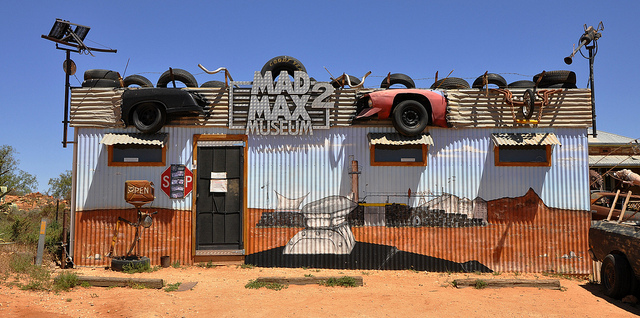
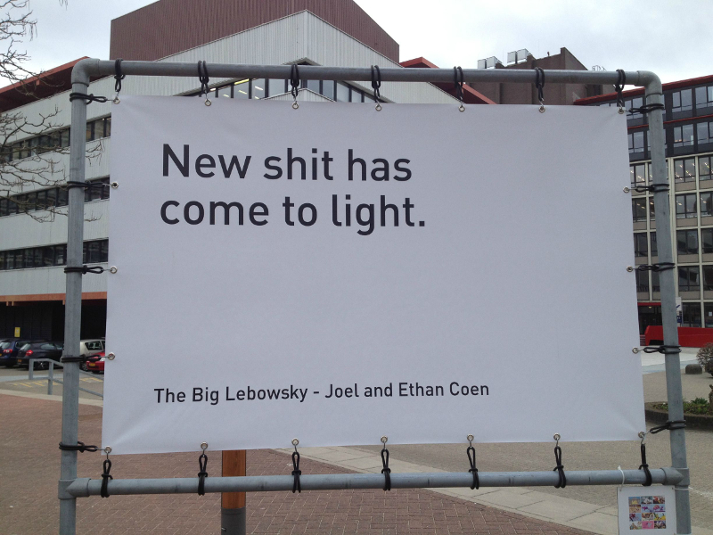
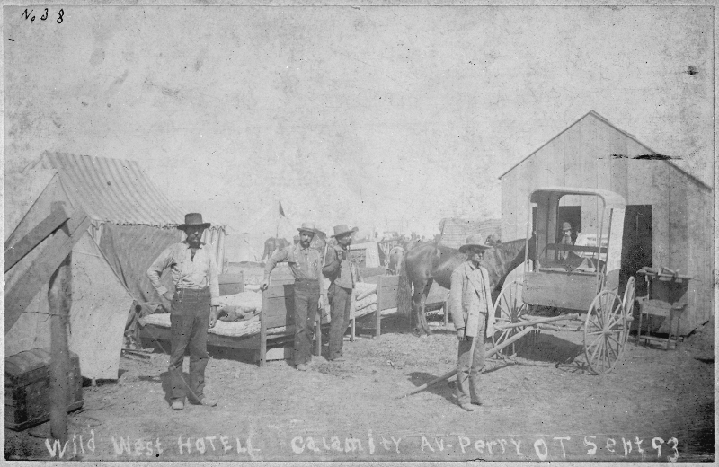
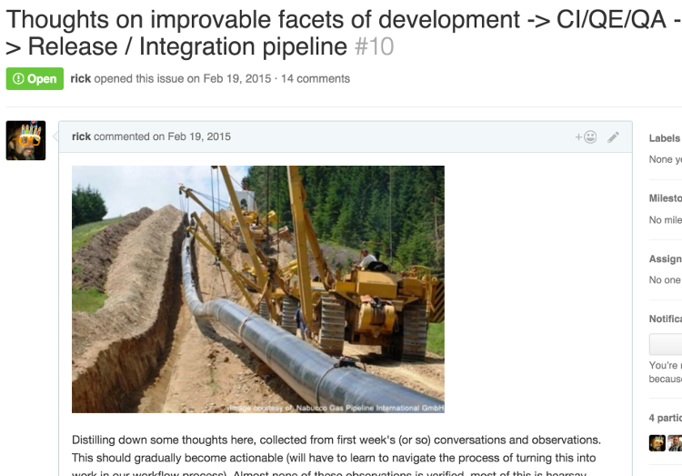
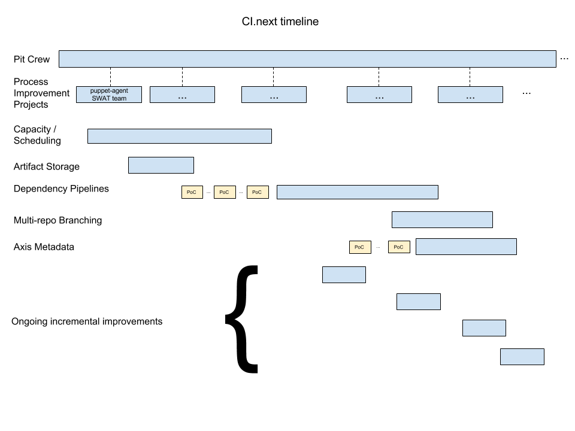

# OMG, what did we build?
## Recovering from the hangover of application success

---

---
# OMG

 
 

## Rick Bradley
### Principal Engineer, Puppet Labs

### github.com/rick

---

## Lives

#### (past and otherwise)

---

### Spent a couple of years trying to rewrite a large clinical system.

 

#### This looked a lot like "green field" work.
#### It totally wasn't.

 

#### "Rewrites" are a messy thing, and quite possibly impossible at any non-trivial scale.

---

### The project was a failure.

---

---

### I mean, I learned a lot.
 

### But, just, fire and craters.

---

### Fortunately, business is often like diplomacy:
 

### There are no "failures", just "frank exchanges of views" and "going back to the table".

---

### Spent 5 years in a 3-person consultancy.

 

#### We thought we were going to do "green field" work.

#### We ended up mostly doing app and team rescues.

---

---

### Spent 2 1/2 years at GitHub.

 

#### We kind of thought we were going to do "green field" work. [_(§)_](https://github.com/rick/roll)

#### We ended up mostly doing app and team rescues.

---

---

### That's a pretty consistent streak of cleaning up after people.

---

### I found myself asking "what is the common factor here?"

---

---

### Obviously, it's working on "apps".

---

###  I've been at Puppet Labs for just over a year.

 

#### Had no illusions that I would be doing "green field" work.

#### I am not working on "apps" now.

#### Currently revamping our processes and streamlining testing, delivery, etc.

---

### i.e., "(_something something_) and team rescues"...

---

### Fortunately these days I never find myself asking

---

## "OMG, Luke, what did you build?!"

---

---

## "Rescues"

---

### What does that even mean?

---

Something exists that is worth keeping around

---

(it's probably getting more and more valuable over time)

---

That something is in a far from ideal state

---

It's big enough that starting over isn't really an option

---

### We are often inclined to believe that the "something" is the code we have built

---

---

## Conway's Law

---

### Awwwww. maaaan.

---

### This is gonna be some tired old shit from Wikipedia isn't it?

---

### Bear with me.

---

> Organizations which design systems ... are constrained to produce designs which are copies of the communication structures of these organizations.

<em> -- Melvin Conway</em>

---

### Blah blah blah

### Yes, that's some tired old shit from Wikipedia.

---

> If you have four groups working on a compiler, you'll get a 4-pass compiler.

<em> -- ESR</em>

---

### More of the same, but for those people who like to talk about ALGOL

---

> The structure of a problem reflects the structure of the organization that created it.

<em> -- Bill Corcoran</em>

---

### Now we're actually getting somewhere

---

### Bringing it back to systems, I understand another variant

---

> Every aspect of a system is a direct result of the interactions of the personalities who built that system.

---

### The features of a system derive from the personalities who built it, acting during a time when those features made some sort of sense.

---

### The haphazard construction of parts of a system result from a time where the people involved could do nothing but make those parts haphazard.

---

### The connections and couplings between parts of a system reflect times when people worked simultaneously on those systems.

---

### Changing a system is almost entirely about working with, working around, and changing the interactions between the people involved with the system.

---

---

## How did we get here?

---

### In the past we saw a need, and an opportunity

---

1. There was a pervasive and persistent problem to be solved.
2. People were willing to pay for a solution to that problem.
3. And we were in a position to do it better than others.

<small><em>h/t <a href="https://twitter.com/ahpook/">@ahpook</a></em></small>

---

### We got into the market and had some early success

---

### We built on that success and chased the market up

---

### We ended up being one of those groups of people who were still left standing some time down the road

---

### [(interlude)](https://www.youtube.com/watch?v=4nsKDJlpUbA)

---

### Impermanence

---

### New shit has come to light

---

### A "rescue" is taking a thing which excelled by a set of past values and transforming it to excel by a set of new values.

---

### To get where we need to be, we need to do a few things...

---

### Understand what is actually important, right now
### (be willing to let go of the past)

 

### Evaluate paths that move us towards our goals

 

### Change the direction of the people and systems involved

---

### Treating the need to change as a technical problem misses the fundamental reality, and will fail.

---

### Not managing the technical aspects of needed change will also result in failure.

---

## Prioritization

---

### In the (Hollywood) Wild West

---

### Gunslingers were much more likely to get shot

---

### Than to live so long they could die of lung cancer

---

### Eventually things get calmer
### And a gunslinger who lived, might even settle down
### At which point, lung cancer and emphysema become actual risks

---

## That was totally a metaphor, y'all

---

---

### We only have finite time, money, and people

 

### So we must be judicious

---

### Which problems do we solve?

 

### Or, conversely, which risks do we minimize?

---

## Case study: Abilities

---

**June 2012**

---

**July 2012**

---

**July 2012**

---

**July 2012**

---

**July 2012**

---

**August 2012**

---

**September 2012**

---

**September 2012**

---

### Acknowledging consensus and getting "buy-in"

---

**September 2012**

---

**September 2012**

---

**November 2012**

---

## Incrementality

---

### Building a consensus and prioritizing goal-driven change is critical

---

### Without these, people will work at cross purposes and positive change will be hugely difficult

---

### But there is a natural tension between "Second Systems", "Big Projects", "Company-wide Initiatives"

 

### and the incremental, piecewise, exploratory, agile work needed to change a complex system.

---

---

### I have spoken elsewhere about the different sizes of intentional change (see my ["Long Refactorings"](http://rick.github.io/long-refactorings-talk/) talk for details)

 

### I will just summarize some techniques here

---

### **For the efforts worth doing**

 

### &nbsp;
### &nbsp;

---

### **There are enough risks that success is unlikely**

 

### &nbsp;
### &nbsp;

---

### **There are enough risks that success is unlikely**

 

### Avoid building a Second System™ -- the promised land of endless biscuits and gravy.

---

### **There are enough risks that success is unlikely**

 

### Aim to minimize costs.
### &nbsp;

---

### **There are enough risks that success is unlikely**

 

### Be iterative rather than Big
### &nbsp;

---

### **There are enough risks that success is unlikely**

 

### Aim to never be a roadblock.
### &nbsp;

---

### **There are enough risks that success is unlikely**

 

### Integrate constantly.  Long-running branches are kryptonite.
### &nbsp;

---

---

## Technical, um, techniques

---

### Do small refactorings when changing a system
### Be knowledgeable of the techniques in Martin Fowler's _Refactoring_ book.

 

### Refactorings at this scale are a commit or few,
### inside the boundary of a larger pull request,
### dedicated to a feature or a bugfix.

---

### Your test suite is almost certainly insufficient to support large changes

---

### If your test suite *is* sufficient to support large changes

 

### You squandered resources at some point

---

### Drive change via tests

 

### Increase test coverage as you make changes

 

### "Characterize" behaviors before changing them

---

---

### Work to be expert in the techniques Michael Feathers outlines:

 

### characterization testing, refactoring to tests, sensing variables, etc.

---

### There are different understandings of your world throughout your organization

---

### Changing the system requires joint understanding

 

### Develop and write down a shared language
### Understand the boundaries between parts of the system

---

### i.e., use Domain-Driven Design

---

### The "Big Ball of Mud" architecture is fine

 

### Any given initiative should focus on one thing
### Don't be distracted by wide-ranging cleanup efforts

---

### Don't be distracted by Cool™ New® Technologies¥
### Always use off-the-shelf until you're backed into a corner

---

### You're probably not backed into a corner. Stop it.

---

## Larger efforts

---

### Understand the goal
### Introduce metrics as safeguards
### Introduce metrics as approximations of the goal
### Incrementally and iteratively refine the system towards optimizing those metrics

---

---

### Use techniques like those from _The Mikado Method_ to explore the feasibility of a significant system change

---

 1. Start with a goal
 2. Do the first small refactoring along the way
 3. See what breaks -- write down a graph node
 4. Repeat until no more dependencies

---

---

## Oh, right.  "abilities"

---

### We had ongoing quality problems in an important part of the system
### Repeated bugfixing did not improve quality significantly
### High level feature changes roadblocked by this core subsystem
### We had built enough consensus, tied to large initiatives, to move this forward

---

---

## The Abilities project:

 

### 4 primary developers
### 795 Pull Requests and Issues from November 2012 until August 2014

 

### Multiple iterations of complete new permissioning systems
### Tight collaboration with ongoing Organization improvements

---

### **From a DDD perspective**

 

### The User / Organization / Team domains had never been properly understood, and were confusingly implemented
 
### We were able to refine these concepts enough to move forward, and refined our shared understanding as necessary

---

### **From a DDD perspective**

 

### The domain concept of a Permission was also weakly understood, and its relationships to Repositories were often implicit

 

### We brought forward the concept of a Capability as a first-class domain concept

---

**November 2012**

---

### Capabilities lived as a new permissions system, side-by-side with existing permissions until August, 2013

---

### Until Abilities came onto the scene.

### Extensive performance testing led us to remodel capabilities so that granting operations were more performant

---

## How did we know?

---

### Wired: "[Clever New GitHub Tool Lets Coders Build Software Like Bridges](http://www.wired.com/2016/02/rebuilding-modern-software-is-like-rebuilding-the-bay-bridge/)"

---

### LOL

---

### Aka [https://github.com/github/scientist](https://github.com/github/scientist)

---

### We built tools to let us (and anyone) run two code paths side-by-side.
### Then performance data was published by instrumentation into our graphite cluster.

---

---

## Don't Roadblock

 

### Long-running branches are kryptonite.
### We could land short-lived branches to "dark ship" new code.
### With science and instrumentation tools we could gather real production measurements in a controlled fashion.

---

## How to run two permission systems at the same time

### One system is the source of all truth.
### Have a migrator that creates the second system's data from the first.
### The data for the second system is updated by actions on the first system.
### Start with just a subset of users.
### Trash the data and re-run the migrator.
### Eventually never re-run the migrator.

---

---

### Sometimes it's just hard to figure out if the code you are changing is even being used. Try to be 100% safe.

---

---

### Just a glorified wrapper around ruby's `caller` method

---

### ... which can be put to holy or horrible uses

---

## The project will ebb and flow

 

### Always have enough side project work available that you can stay fresh and not get bogged down.
### People will come and go (and often return) on a long project.
### You will be at an impasse many times.
### Rely on your team, and allow yourself to experiment with crazy things.
### Your creativity is an asset.

---

## Keeping a long project running

 

### Keep your sense of humor.
### Rely on your peoples.
### Keep close.
### Work-life balance is important.
### Treat it as a marathon.
### Take a vacation.
### You actually can leave and go or do something else.
### It's fine.

---

## Setbacks

 

### "Repository Networks" were all jacked up at the model level
### &nbsp;
### &nbsp;

---

## Setbacks

 

### "Repository Networks" were all jacked up at the model level
### "plan owner" data was all shitty due to old bad job processes
### &nbsp;

---

## Setbacks

 

### "Repository Networks" were all jacked up at the model level
### "plan owner" data was all shitty due to old bad job processes
### Forking and collaborators were all sorts of stupid

---

## Setbacks

 

### You re-learn that you everything is connected
### You end up having to fix way more things than you hoped
### And you make some trade-offs and draw boundaries

---

### Those of you familiar with DDD should be hearing bells ringing right now:

## Bounded contexts!!!

---

### Also, to reiterate an earlier point:

 

### Your test suite is insufficient, even at 100% coverage
### because your test suite can't account for your production data
### and your whole history of bugs and bugfixes

---

## Setbacks

 

### So we wrote data quality scripts to find problems
### We wrote transition scripts to clean up problems
### We wrote throttling tools to make massive transitions never hurt production

---

---

### It can be difficult or impossible to estimate significant changes to an ongoing system

 

### Keep iterating
### Continually communicate and re-negotiate next steps
### Work on the most important blocker Right Now

---

## Enterprise

---

## Enterprise

### Installed GitHub instances behind company firewalls
### Back then were often 6 months behind github.com code base
### Customers could be 300+ days behind last Enterprise release
### We had almost zero visibility into installed versions and data quality at a customer's site
### There were disabled and enabled github.com features on Enterprise

---

## Enterprise

### Data transitions for github.com were bundled with migrations for Enterprise upgrades
### Database tables and ActiveRecord models persisted in github.com code until Enterprise was fully upgraded

---

## Shipping

---

## Shipping

### Made abilities be the "source of truth" for read queries on teams, and orgs
### Made abilities be the "source of truth" for repository read queries
### Continue writing data to *both* permissions systems
### Gradual removal of science experiment code

---

---

---

---

---

---

## Other GitHub "scientist" ships

---

### Rails 3

 

### Yup.  LOL.

---

### GitRPC

---

## Puppet Labs

---

### Landed into Engineering as a "Principal Engineer"

 

### Since all the engineering leads were already, well, leading, I got the opportunity to just roam around for a bit looking at how things work.

 
### (Also, given that I had a history of being a "rescuer", pretty sure no one really wanted me on their team, hahaha)

---

### So I hung out with the "Integration" team
 
### Which is a team of heavy hitters charged with cleaning up whatever comes downstream from the rest of engineering and needs to work well in the released product.

---

### Lots of bottlenecks and process failures

---

### A more classic cousin of Conway's Law...

---

### At some point QA, release engineering, and test automation were moved out into a separate division of Engineering

 

### As a result, eventually developers did not own how their software was tested, how it was built, how it came together for release

---

### **Lots of things went "over the wall"**
 
### Feedback loops got long, developers were unempowered, product releases slowed down, frustration and finger-pointing escalated

 

### My hazy understanding: Release engineering eventually got sick of fixing software thrown over the wall, and so the Integration team was born (closer to home, but still "over the fence")

---

### In early 2014 there were technical attempts to fix problems, starting with the CI (test) system, but the efforts petered out with no significant change

 
### In early 2015 there were "proof of concept" experiments (like we'd done at GitHub with permissioning systems), but they never moved forward

---

### **The fundamental problems were organizational**
 

### Interpersonal and team dynamics that persist over years
### Self-reinforcing patterns of behavior that prevent real change from happening
### Siloing of teams with thick walls preventing cross-cutting change

---

## What now?

---

### We moved testing pipeline definition into version control and made it more self-service

 

### This only took a little concensus building, and the stability benefits were obvious

 

### The side effect is that it makes developers more involved in the testing cycle (it's less over-the-wall)

---

### We started a cross-functional group called The Pit Crew which brings in high-level engineers and test/release folks

 

### It is HIGHLY transparent (more so than any other high-level group in the company)

 

### Its mandate is to find the biggest bottlenecks in the development-to-release cycle and have actual teams prioritize those fixes

---

### For this we had to build high-level consensus that these fixes were necessary to deliver product in the future (because this effort pushes back on product feature work!)

 

### The proof of the commitment is that we already have big bottlenecks being tackled by real people

---

### We are rolling out a long-term (1 year+) revamp of our CI/build/release infrastructure

 

### We need to alleviate fundamental performance and capacity problems
### We need to address deep UX problems, and to make it even more self-service

---

## Building consensus

---

### Working 100% in the open
### Gathering feedback, and conducting group therapy
### Naming the problems to be solved, and the techniques used to solve them
### Avoiding the pitfalls of previous attempts
### Building a roadmap, but keeping downstream intentionally un-detailed
### Fighting Second System Syndrome™
### Cutting through silos

---

---

## Questions?

---

## Image credits:

https://www.flickr.com/photos/jobless_photoman/7512657396/
octocats: [the octodex](https://octodex.github.com) and its creators
https://www.flickr.com/photos/alastair-dunning/5250713135/
https://www.flickr.com/photos/37676753@N08/5117011208/
https://www.flickr.com/photos/affers/10562940573/
http://i.imgur.com/M7scT7C.jpg
https://en.wikipedia.org/wiki/List_of_Old_West_gunfighters
https://www.flickr.com/photos/steveallen/3324325493/
https://www.flickr.com/photos/pixbymaia/9662665997/
https://www.flickr.com/photos/usnavy/7070501561/

---

## Images origin unknown:

 - "What the hell have you built."
 - "What the hell did you build, Luke???"
 - the drinking rooster
 - everything else: The Internets

---
= data-x="1000" data-scale-"2" data-rotate-y="45" data-z="10000"

### (musical interlude)

---
